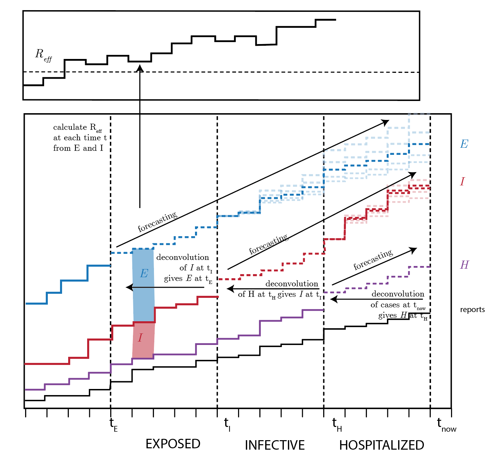

<!-- README.md is generated from README.Rmd. Please edit that file -->

# ncov-nowcast

<!-- badges: start -->

<!-- badges: end -->

Contact: Tim Wildauer (<twildauer@blc.edu>) - deconvolution

Contributors: John Drake (<jdrake@uga.edu>)  
Eric Marty (<emarty@uga.edu>) - visualization Rachel Mercaldo
(<mercaldo@uga.edu>) - forecasting

Initial work was done in <https://github.com/timrwild/2019CoV> and is
being moved into this repo now.

## Contributing

  - Code for functions should go in scripts in the R/ folder.
  - High level scripts or Rmd documents should go at the top level.
  - data is in the /data folder. NOTE: use the data in the folder for
    now; Eric is working on a script to pull it from the google sheet
    where it is kept updated.

## Objective

Estimate a generative model of transmission from infected to uninfected
administrative units.

## Rationale

A key problem in making management decisions is estimating the size of
the epidemic. This project aims to estimate the size of the unknown
epidemic. Case notifications are a poor indicator of epidemic size for
several reasons.

  - Case notifications are incomplete (there is under-reporting).
  - Case notifications are primarily associated with patient isolation
    and therefore are not contributing greatly to transmission.
  - 2019-nCov has a significant incubation period. These presymptomatic
    cases are also part of the epidemic.

## Strategy

This project will use a non-parametric approach to deconvolving the case
notification record to construct the actual size of the epidemic as it
existed at past times (backcasting) and then use the backcasted
estimates to feed a forecasting model that “predicts” the present time
(nowcasting). Our nonparametric approach derives from Tim’s REU project.
Backcasting will proceed in two steps using individual-level
observations for the wait time distributions: (1) construct estimated
curve of patients with symptom onset; (2) construct estimated curve of
patients with active infection. From these curves we will use a
statistical model (perhaps time-varying autoregressive model) to predict
the epidemic size at the current time.

## MODEL

Update: there are now 4 time series, not 3: E (Exposed), I (infected),
H(Hostpitalized), Reported

This is because there isd a lag between hospitalization and case
reporting.

**The period of E** is a stationary distribution (gamma)

**The period of I** is goin down over time due to expanded testing. John
Drake has a mode for this here:
<https://github.com/jdrakephd/wuhan-stochastic-model/blob/master/model-v2.Rmd>

Period of I is stationary distribution through January 16th, then drops
off rapidly.

**The period of H** (hostpitalization) is also going down, and is also
modelled here:
<https://github.com/jdrakephd/wuhan-stochastic-model/blob/master/model-v2.Rmd>

