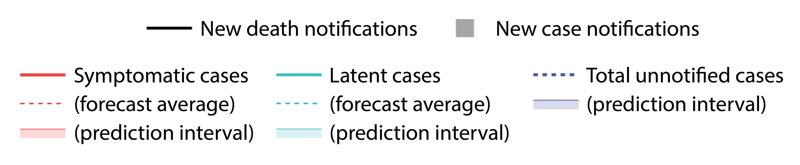

<!-- Knit this page first -->

```{r setup, include=FALSE}

knitr::opts_chunk$set(
  echo=FALSE, message = FALSE, warning = FALSE, cache = FALSE, out.width = '100%', out.height = '550px'
)

# source('R/run_nowcast_global.R') # replaced with sourcing in crontab

library(tidyverse)
source('R/nowcast.R')
#source('R/data.R')

params.global <- readRDS("data/params.global.rds")

load_nowcast <- function(admin) {
  readRDS(paste0("data/output/", admin, ".nowcast.from.cases.rds"))
}

global <- load_nowcast("Global")

cases.global <- readRDS('data/cases.global.rds')
statesvector <- cases.global %>% select(-Date, -Global) %>% names()

for(s in statesvector) {
  assign(s, load_nowcast(s), envir = .GlobalEnv)
}

# start.time <- proc.time()
```


## {.tabset .tabset-fade}

### Global


```{r }

# Plot_R_effective(global, legend = FALSE)

# Export single plot
p <- plot_nowcast_from_case_reports(global, plotcumulative = TRUE, maxy = 10^8, legend = FALSE)
htmlwidgets::saveWidget(p, "Global_nowcast_plot.html")

# plot inline
# plot_nowcast_from_case_reports(global, maxy = 10^8, legend = FALSE)

# plot dashboard
plot_dashboard(global , params.global, plotcumulative = TRUE)
```

### Afghanistan
```{r Afghanistan}
plot_dashboard(Afghanistan, params.global, plotcumulative = TRUE)
```
### Afghanistan
```{r AFG, echo=FALSE, message = FALSE, warning = FALSE, cache = FALSE, out.width = '100%'}
plot_dashboard( Afghanistan, params.global, plotcumulative = TRUE)

```

### Albania
```{r ALB, echo=FALSE, message = FALSE, warning = FALSE, cache = FALSE, out.width = '100%'}
plot_dashboard( Albania, params.global, plotcumulative = TRUE)
```

### Algeria
```{r DZA, echo=FALSE, message = FALSE, warning = FALSE, cache = FALSE, out.width = '100%'}
plot_dashboard( Algeria, params.global, plotcumulative = TRUE)
```

### Andorra
```{r AND, echo=FALSE, message = FALSE, warning = FALSE, cache = FALSE, out.width = '100%'}
plot_dashboard(Andorra , params.global, plotcumulative = TRUE)
```

### Angola
```{r AGO, echo=FALSE, message = FALSE, warning = FALSE, cache = FALSE, out.width = '100%'}
plot_dashboard( Angola, params.global, plotcumulative = TRUE)

```

### Antigua and Barbuda
```{r ATK, echo=FALSE, message = FALSE, warning = FALSE, cache = FALSE, out.width = '100%'}
plot_dashboard( `Antigua and Barbuda`, params.global, plotcumulative = TRUE)
```

### Argentina
```{r ARG, echo=FALSE, message = FALSE, warning = FALSE, cache = FALSE, out.width = '100%'}
plot_dashboard( Argentina, params.global, plotcumulative = TRUE)
```

### Armenia
```{r ARM, echo=FALSE, message = FALSE, warning = FALSE, cache = FALSE, out.width = '100%'}
plot_dashboard( Armenia, params.global, plotcumulative = TRUE)
```

### Austria
```{r AUS, echo=FALSE, message = FALSE, warning = FALSE, cache = FALSE, out.width = '100%'}
plot_dashboard( Austria, params.global, plotcumulative = TRUE)
```

### Azerbaijan
```{r AZE, echo=FALSE, message = FALSE, warning = FALSE, cache = FALSE, out.width = '100%'}
plot_dashboard( Azerbaijan, params.global, plotcumulative = TRUE)
```

### Bahamas
```{r BHS , echo=FALSE, message = FALSE, warning = FALSE, cache = FALSE, out.width = '100%'}
plot_dashboard( Bahamas, params.global, plotcumulative = TRUE)
```

### Bahrain
```{r BHR , echo=FALSE, message = FALSE, warning = FALSE, cache = FALSE, out.width = '100%'}
plot_dashboard( Bahrain, params.global, plotcumulative = TRUE)
```

### Bangladesh
```{r BGD, echo=FALSE, message = FALSE, warning = FALSE, cache = FALSE, out.width = '100%'}
plot_dashboard( Bangladesh, params.global, plotcumulative = TRUE)
```

### Barbados
```{r BRB, echo=FALSE, message = FALSE, warning = FALSE, cache = FALSE, out.width = '100%'}
plot_dashboard( Barbados, params.global, plotcumulative = TRUE)
```

### Belarus
```{r BLR, echo=FALSE, message = FALSE, warning = FALSE, cache = FALSE, out.width = '100%'}
plot_dashboard( Belarus, params.global, plotcumulative = TRUE)
```

### Belgium
```{r BEL, echo=FALSE, message = FALSE, warning = FALSE, cache = FALSE, out.width = '100%'}
plot_dashboard( Belgium, params.global, plotcumulative = TRUE)
```

### Belize
```{r BLZ, echo=FALSE, message = FALSE, warning = FALSE, cache = FALSE, out.width = '100%'}
plot_dashboard( Belize, params.global, plotcumulative = TRUE)
```

### Benin
```{r BEN, echo=FALSE, message = FALSE, warning = FALSE, cache = FALSE, out.width = '100%'}
plot_dashboard( Benin, params.global, plotcumulative = TRUE)
```

### Bhutan
```{r BTN, echo=FALSE, message = FALSE, warning = FALSE, cache = FALSE, out.width = '100%'}
plot_dashboard( Bhutan, params.global, plotcumulative = TRUE)
```

### Bolivia
```{r BES, echo=FALSE, message = FALSE, warning = FALSE, cache = FALSE, out.width = '100%'}
plot_dashboard( Bolivia, params.global, plotcumulative = TRUE)
```

### Bosnia and Herzegovina
```{r BIH, echo=FALSE, message = FALSE, warning = FALSE, cache = FALSE, out.width = '100%'}
plot_dashboard( `Bosnia and Herzegovina`, params.global, plotcumulative = TRUE)
```

### Botswana
```{r BWA, echo=FALSE, message = FALSE, warning = FALSE, cache = FALSE, out.width = '100%'}
plot_dashboard( Botswana, params.global, plotcumulative = TRUE)
```

### Brazil
```{r BRA, echo=FALSE, message = FALSE, warning = FALSE, cache = FALSE, out.width = '100%'}
plot_dashboard( Brazil, params.global, plotcumulative = TRUE)
```

### Brunei
```{r BRN, echo=FALSE, message = FALSE, warning = FALSE, cache = FALSE, out.width = '100%'}
plot_dashboard( Brunei, params.global, plotcumulative = TRUE)
```

### Bulgaria
```{r BGR, echo=FALSE, message = FALSE, warning = FALSE, cache = FALSE, out.width = '100%'}
plot_dashboard( Bulgaria, params.global, plotcumulative = TRUE)
```

### Burkina Faso
```{r BFA, echo=FALSE, message = FALSE, warning = FALSE, cache = FALSE, out.width = '100%'}
plot_dashboard( `Burkina Faso`, params.global, plotcumulative = TRUE)
```

### Burma(Myanmar)
```{r MMR, echo=FALSE, message = FALSE, warning = FALSE, cache = FALSE, out.width = '100%'}
plot_dashboard(  Burma, params.global, plotcumulative = TRUE)
```

### Burundi
```{r BDI, echo=FALSE, message = FALSE, warning = FALSE, cache = FALSE, out.width = '100%'}
plot_dashboard( Burundi, params.global, plotcumulative = TRUE)
```

### Cabo Verde
```{r CPV, echo=FALSE, message = FALSE, warning = FALSE, cache = FALSE, out.width = '100%'}
plot_dashboard( `Cabo Verde`, params.global, plotcumulative = TRUE)
```

### Cambodia
```{r KHM, echo=FALSE, message = FALSE, warning = FALSE, cache = FALSE, out.width = '100%'}
plot_dashboard( Cambodia, params.global, plotcumulative = TRUE)
```

### Cameroon
```{r CMR, echo=FALSE, message = FALSE, warning = FALSE, cache = FALSE, out.width = '100%'}
plot_dashboard( Cameroon, params.global, plotcumulative = TRUE)
```

### Canada
```{r CAN, echo=FALSE, message = FALSE, warning = FALSE, cache = FALSE, out.width = '100%'}
plot_dashboard( Canada, params.global, plotcumulative = TRUE)
```


### Central African Republic
```{r CAF, echo=FALSE, message = FALSE, warning = FALSE, cache = FALSE, out.width = '100%'}
plot_dashboard( `Central African Republic`, params.global, plotcumulative = TRUE)
```

### Chad
```{r TCD, echo=FALSE, message = FALSE, warning = FALSE, cache = FALSE, out.width = '100%'}
plot_dashboard( Chad, params.global, plotcumulative = TRUE)
```

### Chile
```{r CHL, echo=FALSE, message = FALSE, warning = FALSE, cache = FALSE, out.width = '100%'}
plot_dashboard( Chile, params.global, plotcumulative = TRUE)
```

### China
```{r CHN, echo=FALSE, message = FALSE, warning = FALSE, cache = FALSE, out.width = '100%'}
plot_dashboard( China, params.global, plotcumulative = TRUE)
```

### Colombia
```{r COL, echo=FALSE, message = FALSE, warning = FALSE, cache = FALSE, out.width = '100%'}
plot_dashboard( Colombia, params.global, plotcumulative = TRUE)
```

### Comoros
```{r COM, echo=FALSE, message = FALSE, warning = FALSE, cache = FALSE, out.width = '100%'}
plot_dashboard( Comoros, params.global, plotcumulative = TRUE)
```

### Congo (Brazzaville)
```{r COG, echo=FALSE, message = FALSE, warning = FALSE, cache = FALSE, out.width = '100%'}
plot_dashboard( `Congo (Brazzaville)`, params.global, plotcumulative = TRUE)
```

### Congo (Kinshasa)
```{r COD, echo=FALSE, message = FALSE, warning = FALSE, cache = FALSE, out.width = '100%'}
plot_dashboard( `Congo (Kinshasa)`, params.global, plotcumulative = TRUE)
```

### "Costa Rica"
```{r CRI, echo=FALSE, message = FALSE, warning = FALSE, cache = FALSE, out.width = '100%'}
plot_dashboard( `Costa Rica`, params.global, plotcumulative = TRUE)
```

### "Cote d'Ivoire"
```{r CIV, echo=FALSE, message = FALSE, warning = FALSE, cache = FALSE, out.width = '100%'}
plot_dashboard( `Cote d'Ivoire`, params.global, plotcumulative = TRUE)
```

### Croatia
```{r HRV, echo=FALSE, message = FALSE, warning = FALSE, cache = FALSE, out.width = '100%'}
plot_dashboard( Croatia, params.global, plotcumulative = TRUE)
```

### Cuba
```{r CUB, echo=FALSE, message = FALSE, warning = FALSE, cache = FALSE, out.width = '100%'}
plot_dashboard( Cuba, params.global, plotcumulative = TRUE)
```

### Cyprus
```{r CYP, echo=FALSE, message = FALSE, warning = FALSE, cache = FALSE, out.width = '100%'}
plot_dashboard( Cyprus, params.global, plotcumulative = TRUE)
```

### Czechia
```{r CZE, echo=FALSE, message = FALSE, warning = FALSE, cache = FALSE, out.width = '100%'}
plot_dashboard( Czechia, params.global, plotcumulative = TRUE)
```

### Denmark
```{r DNK, echo=FALSE, message = FALSE, warning = FALSE, cache = FALSE, out.width = '100%'}
plot_dashboard( Denmark, params.global, plotcumulative = TRUE)
```

### Djibouti
```{r DJI, echo=FALSE, message = FALSE, warning = FALSE, cache = FALSE, out.width = '100%'}
plot_dashboard( Djibouti, params.global, plotcumulative = TRUE)
```

### Dominica
```{r DMA, echo=FALSE, message = FALSE, warning = FALSE, cache = FALSE, out.width = '100%'}
plot_dashboard( Dominica, params.global, plotcumulative = TRUE)
```

### Dominican Republic
```{r DOM, echo=FALSE, message = FALSE, warning = FALSE, cache = FALSE, out.width = '100%'}
plot_dashboard( `Dominican Republic`, params.global, plotcumulative = TRUE)
```

### Ecuador
```{r ECU, echo=FALSE, message = FALSE, warning = FALSE, cache = FALSE, out.width = '100%'}
plot_dashboard( Ecuador, params.global, plotcumulative = TRUE)
```

### Egypt
```{r EGY, echo=FALSE, message = FALSE, warning = FALSE, cache = FALSE, out.width = '100%'}
plot_dashboard( Egypt, params.global, plotcumulative = TRUE)
```

### El Salvador
```{r SLV, echo=FALSE, message = FALSE, warning = FALSE, cache = FALSE, out.width = '100%'}
plot_dashboard( `El Salvador`, params.global, plotcumulative = TRUE)
```

### Equatorial Guinea
```{r GNQ, echo=FALSE, message = FALSE, warning = FALSE, cache = FALSE, out.width = '100%'}
plot_dashboard( `Equatorial Guinea`, params.global, plotcumulative = TRUE)
```

### Eritrea
```{r ERI, echo=FALSE, message = FALSE, warning = FALSE, cache = FALSE, out.width = '100%'}
plot_dashboard( Eritrea, params.global, plotcumulative = TRUE)
```

### Estonia
```{r EST, echo=FALSE, message = FALSE, warning = FALSE, cache = FALSE, out.width = '100%'}
plot_dashboard( Estonia, params.global, plotcumulative = TRUE)
```

### Eswatini
```{r SWZ, echo=FALSE, message = FALSE, warning = FALSE, cache = FALSE, out.width = '100%'}
plot_dashboard( Eswatini, params.global, plotcumulative = TRUE)
```

### Ethiopia
```{r ETH, echo=FALSE, message = FALSE, warning = FALSE, cache = FALSE, out.width = '100%'}
plot_dashboard( Ethiopia, params.global, plotcumulative = TRUE)
```

### Fiji
```{r FJI, echo=FALSE, message = FALSE, warning = FALSE, cache = FALSE, out.width = '100%'}
plot_dashboard( Fiji, params.global, plotcumulative = TRUE)
```

### Finland
```{r FIN, echo=FALSE, message = FALSE, warning = FALSE, cache = FALSE, out.width = '100%'}
plot_dashboard( Finland, params.global, plotcumulative = TRUE)
```

### France
```{r FRA,  echo=FALSE, message = FALSE, warning = FALSE, cache = FALSE, out.width = '100%'}
plot_dashboard( France, params.global, plotcumulative = TRUE)
```


### Gabon
```{r GAB, echo=FALSE, message = FALSE, warning = FALSE, cache = FALSE, out.width = '100%'}
plot_dashboard( Gabon, params.global, plotcumulative = TRUE)
```

### Gambia
```{r GMB, echo=FALSE, message = FALSE, warning = FALSE, cache = FALSE, out.width = '100%'}
plot_dashboard( Gambia, params.global, plotcumulative = TRUE)
```

### Georgia
```{r GEO, echo=FALSE, message = FALSE, warning = FALSE, cache = FALSE, out.width = '100%'}
plot_dashboard( Georgia, params.global, plotcumulative = TRUE)
```

### Germany
```{r DEU, echo=FALSE, message = FALSE, warning = FALSE, cache = FALSE, out.width = '100%'}
plot_dashboard( Germany, params.global, plotcumulative = TRUE)
```

### Ghana
```{r GHA, echo=FALSE, message = FALSE, warning = FALSE, cache = FALSE, out.width = '100%'}
plot_dashboard( Ghana, params.global, plotcumulative = TRUE)
```

### Greece
```{r GRL, echo=FALSE, message = FALSE, warning = FALSE, cache = FALSE, out.width = '100%'}
plot_dashboard( Greece, params.global, plotcumulative = TRUE)
```

### Grenada
```{r GRD, echo=FALSE, message = FALSE, warning = FALSE, cache = FALSE, out.width = '100%'}
plot_dashboard( Grenada, params.global, plotcumulative = TRUE)
```

### Guatemala
```{r GTM, echo=FALSE, message = FALSE, warning = FALSE, cache = FALSE, out.width = '100%'}
plot_dashboard( Guatemala, params.global, plotcumulative = TRUE)
```

### Guinea
```{r GIN, echo=FALSE, message = FALSE, warning = FALSE, cache = FALSE, out.width = '100%'}
plot_dashboard( Guinea, params.global, plotcumulative = TRUE)
```

### Guinea-Bissau
```{r GNB, echo=FALSE, message = FALSE, warning = FALSE, cache = FALSE, out.width = '100%'}
plot_dashboard( `Guinea-Bissau`, params.global, plotcumulative = TRUE)
```

### Guyana
```{r GUY, echo=FALSE, message = FALSE, warning = FALSE, cache = FALSE, out.width = '100%'}
plot_dashboard( Guyana, params.global, plotcumulative = TRUE)
```

### Haiti
```{r HTI, echo=FALSE, message = FALSE, warning = FALSE, cache = FALSE, out.width = '100%'}
plot_dashboard( Haiti, params.global, plotcumulative = TRUE)
```

### Honduras
```{r HND, echo=FALSE, message = FALSE, warning = FALSE, cache = FALSE, out.width = '100%'}
plot_dashboard( Honduras, params.global, plotcumulative = TRUE)
```

### Hungary
```{r HUN, echo=FALSE, message = FALSE, warning = FALSE, cache = FALSE, out.width = '100%'}
plot_dashboard( Hungary, params.global, plotcumulative = TRUE)
```

### Iceland
```{r ISL, echo=FALSE, message = FALSE, warning = FALSE, cache = FALSE, out.width = '100%'}
plot_dashboard( Iceland, params.global, plotcumulative = TRUE)
```

### India
```{r IND, echo=FALSE, message = FALSE, warning = FALSE, cache = FALSE, out.width = '100%'}
plot_dashboard( India, params.global, plotcumulative = TRUE)
```

### Indonesia
```{r IDN, echo=FALSE, message = FALSE, warning = FALSE, cache = FALSE, out.width = '100%'}
plot_dashboard( Indonesia, params.global, plotcumulative = TRUE)
```

### Iran
```{r IRN, echo=FALSE, message = FALSE, warning = FALSE, cache = FALSE, out.width = '100%'}
plot_dashboard( Iran, params.global, plotcumulative = TRUE)
```

### Iraq
```{r IRQ, echo=FALSE, message = FALSE, warning = FALSE, cache = FALSE, out.width = '100%'}
plot_dashboard( Iraq, params.global, plotcumulative = TRUE)
```

### Ireland
```{r IRL, echo=FALSE, message = FALSE, warning = FALSE, cache = FALSE, out.width = '100%'}
plot_dashboard( Ireland, params.global, plotcumulative = TRUE)
```

### Israel
```{r ISR, echo=FALSE, message = FALSE, warning = FALSE, cache = FALSE, out.width = '100%'}
plot_dashboard( Israel, params.global, plotcumulative = TRUE)
```

### Italy
```{r ITA, echo=FALSE, message = FALSE, warning = FALSE, cache = FALSE, out.width = '100%'}
plot_dashboard( Italy, params.global, plotcumulative = TRUE)
```

### Jamaica
```{r JAM, echo=FALSE, message = FALSE, warning = FALSE, cache = FALSE, out.width = '100%'}
plot_dashboard( Jamaica, params.global, plotcumulative = TRUE)
```

### Japan
```{r JPN, echo=FALSE, message = FALSE, warning = FALSE, cache = FALSE, out.width = '100%'}
plot_dashboard( Japan, params.global, plotcumulative = TRUE)
```

### Jordan
```{r JOR, echo=FALSE, message = FALSE, warning = FALSE, cache = FALSE, out.width = '100%'}
plot_dashboard( Jordan, params.global, plotcumulative = TRUE)
```

### Kazakhstan
```{r KAZ, echo=FALSE, message = FALSE, warning = FALSE, cache = FALSE, out.width = '100%'}
plot_dashboard( Kazakhstan, params.global, plotcumulative = TRUE)
```

### Kenya
```{r KEN, echo=FALSE, message = FALSE, warning = FALSE, cache = FALSE, out.width = '100%'}
plot_dashboard( Kenya, params.global, plotcumulative = TRUE)
```

### Korea, South
```{r KOR, echo=FALSE, message = FALSE, warning = FALSE, cache = FALSE, out.width = '100%'}
plot_dashboard( `Korea, South`, params.global, plotcumulative = TRUE)
```

### Kosovo
```{r XKO, echo=FALSE, message = FALSE, warning = FALSE, cache = FALSE, out.width = '100%'}
plot_dashboard( Kosovo, params.global, plotcumulative = TRUE)
```

### Kuwait
```{r KWT, echo=FALSE, message = FALSE, warning = FALSE, cache = FALSE, out.width = '100%'}
plot_dashboard( Kuwait, params.global, plotcumulative = TRUE)
```

### Kyrgyzstan
```{r KGZ, echo=FALSE, message = FALSE, warning = FALSE, cache = FALSE, out.width = '100%'}
plot_dashboard( Kyrgyzstan, params.global, plotcumulative = TRUE)
```

### Laos
```{r LAO, echo=FALSE, message = FALSE, warning = FALSE, cache = FALSE, out.width = '100%'}
plot_dashboard( Laos, params.global, plotcumulative = TRUE)
```

### Latvia
```{r LVA, echo=FALSE, message = FALSE, warning = FALSE, cache = FALSE, out.width = '100%'}
plot_dashboard( Latvia, params.global, plotcumulative = TRUE)
```

### Lebanon
```{r LBN, echo=FALSE, message = FALSE, warning = FALSE, cache = FALSE, out.width = '100%'}
plot_dashboard( Lebanon, params.global, plotcumulative = TRUE)
```

### Lesotho
```{r LSO, echo=FALSE, message = FALSE, warning = FALSE, cache = FALSE, out.width = '100%'}
plot_dashboard( Lesotho, params.global, plotcumulative = TRUE)
```

### Liberia
```{r LBR, echo=FALSE, message = FALSE, warning = FALSE, cache = FALSE, out.width = '100%'}
plot_dashboard( Liberia, params.global, plotcumulative = TRUE)
```

### Libya
```{r LBY, echo=FALSE, message = FALSE, warning = FALSE, cache = FALSE, out.width = '100%'}
plot_dashboard( Libya, params.global, plotcumulative = TRUE)
```

### Liechtenstein
```{r LIE, echo=FALSE, message = FALSE, warning = FALSE, cache = FALSE, out.width = '100%'}
plot_dashboard( Liechtenstein, params.global, plotcumulative = TRUE)
```

### Lithuania
```{r LTU, echo=FALSE, message = FALSE, warning = FALSE, cache = FALSE, out.width = '100%'}
plot_dashboard( Lithuania, params.global, plotcumulative = TRUE)
```

### Luxembourg
```{r LUX, echo=FALSE, message = FALSE, warning = FALSE, cache = FALSE, out.width = '100%'}
plot_dashboard( Luxembourg, params.global, plotcumulative = TRUE)
```

### Madagascar
```{r MDG, echo=FALSE, message = FALSE, warning = FALSE, cache = FALSE, out.width = '100%'}
plot_dashboard( Madagascar, params.global, plotcumulative = TRUE)
```

### Malawi
```{r MWI, echo=FALSE, message = FALSE, warning = FALSE, cache = FALSE, out.width = '100%'}
plot_dashboard( Malawi, params.global, plotcumulative = TRUE)
```

### Malaysia
```{r MYS, echo=FALSE, message = FALSE, warning = FALSE, cache = FALSE, out.width = '100%'}
plot_dashboard( Malaysia, params.global, plotcumulative = TRUE)
```

### Maldives
```{r MDV, echo=FALSE, message = FALSE, warning = FALSE, cache = FALSE, out.width = '100%'}
plot_dashboard( Maldives, params.global, plotcumulative = TRUE)
```

### Mali
```{r MLI, echo=FALSE, message = FALSE, warning = FALSE, cache = FALSE, out.width = '100%'}
plot_dashboard( Mali, params.global, plotcumulative = TRUE)
```

### Malta
```{r MTQ, echo=FALSE, message = FALSE, warning = FALSE, cache = FALSE, out.width = '100%'}
plot_dashboard( Malta, params.global, plotcumulative = TRUE)
```

### Marshall Islands
```{r MRT, echo=FALSE, message = FALSE, warning = FALSE, cache = FALSE, out.width = '100%'}
plot_dashboard( `Marshall Islands`, params.global, plotcumulative = TRUE)
```


### Mauritania
```{r MAU, echo=FALSE, message = FALSE, warning = FALSE, cache = FALSE, out.width = '100%'}
plot_dashboard( Mauritania, params.global, plotcumulative = TRUE)
```

### Mauritius
```{r MYT, echo=FALSE, message = FALSE, warning = FALSE, cache = FALSE, out.width = '100%'}
plot_dashboard( Mauritius, params.global, plotcumulative = TRUE)
```

### Mexico
```{r MEX, echo=FALSE, message = FALSE, warning = FALSE, cache = FALSE, out.width = '100%'}
plot_dashboard( Mexico, params.global, plotcumulative = TRUE)
```

### Moldova
```{r MDA, echo=FALSE, message = FALSE, warning = FALSE, cache = FALSE, out.width = '100%'}
plot_dashboard( Moldova, params.global, plotcumulative = TRUE)
```

### Monaco
```{r MCO, echo=FALSE, message = FALSE, warning = FALSE, cache = FALSE, out.width = '100%'}
plot_dashboard( Monaco, params.global, plotcumulative = TRUE)
```

### Mongolia
```{r MSR, echo=FALSE, message = FALSE, warning = FALSE, cache = FALSE, out.width = '100%'}
plot_dashboard( Mongolia, params.global, plotcumulative = TRUE)
```

### Montenegro
```{r MNE, echo=FALSE, message = FALSE, warning = FALSE, cache = FALSE, out.width = '100%'}
plot_dashboard( Montenegro, params.global, plotcumulative = TRUE)
```

### Morocco
```{r MAR, echo=FALSE, message = FALSE, warning = FALSE, cache = FALSE, out.width = '100%'}
plot_dashboard( Morocco, params.global, plotcumulative = TRUE)
```

### Mozambique
```{r MOZ, echo=FALSE, message = FALSE, warning = FALSE, cache = FALSE, out.width = '100%'}
plot_dashboard( Mozambique, params.global, plotcumulative = TRUE)
```

### Namibia
```{r NAM, echo=FALSE, message = FALSE, warning = FALSE, cache = FALSE, out.width = '100%'}
plot_dashboard( Namibia, params.global, plotcumulative = TRUE)
```

### Nepal
```{r NPL, echo=FALSE, message = FALSE, warning = FALSE, cache = FALSE, out.width = '100%'}
plot_dashboard( Nepal, params.global, plotcumulative = TRUE)
```

### Netherlands
```{r NLD, echo=FALSE, message = FALSE, warning = FALSE, cache = FALSE, out.width = '100%'}
plot_dashboard( Netherlands, params.global, plotcumulative = TRUE)
```

### New Zealand
```{r NZL, echo=FALSE, message = FALSE, warning = FALSE, cache = FALSE, out.width = '100%'}
plot_dashboard( `New Zealand`, params.global, plotcumulative = TRUE)
```

### Nicaragua
```{r NIC, echo=FALSE, message = FALSE, warning = FALSE, cache = FALSE, out.width = '100%'}
plot_dashboard( Nicaragua, params.global, plotcumulative = TRUE)
```

### Niger
```{r NER, echo=FALSE, message = FALSE, warning = FALSE, cache = FALSE, out.width = '100%'}
plot_dashboard( Niger, params.global, plotcumulative = TRUE)
```

### Nigeria
```{r NGA, echo=FALSE, message = FALSE, warning = FALSE, cache = FALSE, out.width = '100%'}
plot_dashboard( Nigeria, params.global, plotcumulative = TRUE)
```

### North Macedonia
```{r MKD, echo=FALSE, message = FALSE, warning = FALSE, cache = FALSE, out.width = '100%'}
plot_dashboard( `North Macedonia`, params.global, plotcumulative = TRUE)
```

### Norway
```{r NOR, echo=FALSE, message = FALSE, warning = FALSE, cache = FALSE, out.width = '100%'}
plot_dashboard( Norway, params.global, plotcumulative = TRUE)
```

### Oman
```{r OMN, echo=FALSE, message = FALSE, warning = FALSE, cache = FALSE, out.width = '100%'}
plot_dashboard( Oman, params.global, plotcumulative = TRUE)
```

### Pakistan
```{r PAK, echo=FALSE, message = FALSE, warning = FALSE, cache = FALSE, out.width = '100%'}
plot_dashboard( Pakistan, params.global, plotcumulative = TRUE)
```

### Panama
```{r PAN, echo=FALSE, message = FALSE, warning = FALSE, cache = FALSE, out.width = '100%'}
plot_dashboard( Panama, params.global, plotcumulative = TRUE)
```

### Papua New Guinea
```{r PNG, echo=FALSE, message = FALSE, warning = FALSE, cache = FALSE, out.width = '100%'}
plot_dashboard( `Papua New Guinea`, params.global, plotcumulative = TRUE)
```

### Paraguay
```{r PRY, echo=FALSE, message = FALSE, warning = FALSE, cache = FALSE, out.width = '100%'}
plot_dashboard( Paraguay, params.global, plotcumulative = TRUE)
```

### Peru
```{r PER, echo=FALSE, message = FALSE, warning = FALSE, cache = FALSE, out.width = '100%'}
plot_dashboard( Peru, params.global, plotcumulative = TRUE)
```

### Philippines
```{r PHL, echo=FALSE, message = FALSE, warning = FALSE, cache = FALSE, out.width = '100%'}
plot_dashboard( Philippines, params.global, plotcumulative = TRUE)
```

### Poland
```{r POL, echo=FALSE, message = FALSE, warning = FALSE, cache = FALSE, out.width = '100%'}
plot_dashboard( Poland, params.global, plotcumulative = TRUE)
```

### Portugal
```{r PRT, echo=FALSE, message = FALSE, warning = FALSE, cache = FALSE, out.width = '100%'}
plot_dashboard( Portugal, params.global, plotcumulative = TRUE)
```

### Qatar
```{r QAT, echo=FALSE, message = FALSE, warning = FALSE, cache = FALSE, out.width = '100%'}
plot_dashboard( Qatar, params.global, plotcumulative = TRUE)
```

### Romania
```{r ROU, echo=FALSE, message = FALSE, warning = FALSE, cache = FALSE, out.width = '100%'}
plot_dashboard( Romania, params.global, plotcumulative = TRUE)
```

### Russia
```{r RUS, echo=FALSE, message = FALSE, warning = FALSE, cache = FALSE, out.width = '100%'}
plot_dashboard( Russia, params.global, plotcumulative = TRUE)
```

### Rwanda
```{r RWA, echo=FALSE, message = FALSE, warning = FALSE, cache = FALSE, out.width = '100%'}
plot_dashboard( Rwanda, params.global, plotcumulative = TRUE)
```

### Saint Kitts and Nevis
```{r KNA, echo=FALSE, message = FALSE, warning = FALSE, cache = FALSE, out.width = '100%'}
plot_dashboard( `Saint Kitts and Nevis`, params.global, plotcumulative = TRUE)
```

### Saint Lucia
```{r LCA, echo=FALSE, message = FALSE, warning = FALSE, cache = FALSE, out.width = '100%'}
plot_dashboard( `Saint Lucia`, params.global, plotcumulative = TRUE)
```

### Saint Vincent and the Grenadines
```{r VCT, echo=FALSE, message = FALSE, warning = FALSE, cache = FALSE, out.width = '100%'}
plot_dashboard( `Saint Vincent and the Grenadines`, params.global, plotcumulative = TRUE)
```

### San Marino
```{r SMR, echo=FALSE, message = FALSE, warning = FALSE, cache = FALSE, out.width = '100%'}
plot_dashboard( `San Marino`, params.global, plotcumulative = TRUE)
```

### Sao Tome and Principe
```{r STP, echo=FALSE, message = FALSE, warning = FALSE, cache = FALSE, out.width = '100%'}
plot_dashboard( `Sao Tome and Principe`, params.global, plotcumulative = TRUE)
```

### Saudi Arabia
```{r SAU, echo=FALSE, message = FALSE, warning = FALSE, cache = FALSE, out.width = '100%'}
plot_dashboard( `Saudi Arabia`, params.global, plotcumulative = TRUE)
```

### Senegal
```{r SEN, echo=FALSE, message = FALSE, warning = FALSE, cache = FALSE, out.width = '100%'}
plot_dashboard( Senegal, params.global, plotcumulative = TRUE)
```

### Serbia
```{r SRB, echo=FALSE, message = FALSE, warning = FALSE, cache = FALSE, out.width = '100%'}
plot_dashboard( Serbia, params.global, plotcumulative = TRUE)
```

### Seychelles
```{r SYC, echo=FALSE, message = FALSE, warning = FALSE, cache = FALSE, out.width = '100%'}
plot_dashboard( Seychelles, params.global, plotcumulative = TRUE)
```

### Sierra Leone
```{r SLE, echo=FALSE, message = FALSE, warning = FALSE, cache = FALSE, out.width = '100%'}
plot_dashboard( `Sierra Leone`, params.global, plotcumulative = TRUE)
```

### Singapore
```{r SGP, echo=FALSE, message = FALSE, warning = FALSE, cache = FALSE, out.width = '100%'}
plot_dashboard( Singapore, params.global, plotcumulative = TRUE)
```

### Slovakia
```{r SVK, echo=FALSE, message = FALSE, warning = FALSE, cache = FALSE, out.width = '100%'}
plot_dashboard( Slovakia, params.global, plotcumulative = TRUE)
```

### Slovenia
```{r SVN, echo=FALSE, message = FALSE, warning = FALSE, cache = FALSE, out.width = '100%'}
plot_dashboard( Slovenia, params.global, plotcumulative = TRUE)
```

### Somalia
```{r SOM, echo=FALSE, message = FALSE, warning = FALSE, cache = FALSE, out.width = '100%'}
plot_dashboard( Somalia, params.global, plotcumulative = TRUE)
```

### South Africa
```{r ZAF, echo=FALSE, message = FALSE, warning = FALSE, cache = FALSE, out.width = '100%'}
plot_dashboard( `South Africa`, params.global, plotcumulative = TRUE)
```

### South Sudan
```{r SSD, echo=FALSE, message = FALSE, warning = FALSE, cache = FALSE, out.width = '100%'}
plot_dashboard( `South Sudan`, params.global, plotcumulative = TRUE)
```

### Spain
```{r ESP, echo=FALSE, message = FALSE, warning = FALSE, cache = FALSE, out.width = '100%'}
plot_dashboard( Spain, params.global, plotcumulative = TRUE)
```

### Sri Lanka
```{r LKA, echo=FALSE, message = FALSE, warning = FALSE, cache = FALSE, out.width = '100%'}
plot_dashboard( `Sri Lanka`, params.global, plotcumulative = TRUE)
```

### Sudan
```{r SDN, echo=FALSE, message = FALSE, warning = FALSE, cache = FALSE, out.width = '100%'}
plot_dashboard( Sudan, params.global, plotcumulative = TRUE)
```

### Sweden
```{r SWE, echo=FALSE, message = FALSE, warning = FALSE, cache = FALSE, out.width = '100%'}
plot_dashboard( Sweden, params.global, plotcumulative = TRUE)
```

### Switzerland
```{r CHE, echo=FALSE, message = FALSE, warning = FALSE, cache = FALSE, out.width = '100%'}
plot_dashboard( Switzerland, params.global, plotcumulative = TRUE)
```

### Syria
```{r SYR, echo=FALSE, message = FALSE, warning = FALSE, cache = FALSE, out.width = '100%'}
plot_dashboard( Syria, params.global, plotcumulative = TRUE)
```

### Taiwan*
```{r TWN, echo=FALSE, message = FALSE, warning = FALSE, cache = FALSE, out.width = '100%'}
plot_dashboard( `Taiwan*`, params.global, plotcumulative = TRUE)
```

### Tajikistan
```{r TJK, echo=FALSE, message = FALSE, warning = FALSE, cache = FALSE, out.width = '100%'}
plot_dashboard( Tajikistan, params.global, plotcumulative = TRUE)
```

### Tanzania
```{r TZA, echo=FALSE, message = FALSE, warning = FALSE, cache = FALSE, out.width = '100%'}
plot_dashboard( Tanzania, params.global, plotcumulative = TRUE)
```

### Thailand
```{r THA, echo=FALSE, message = FALSE, warning = FALSE, cache = FALSE, out.width = '100%'}
plot_dashboard( Thailand, params.global, plotcumulative = TRUE)
```

### Timor-Leste
```{r TLS, echo=FALSE, message = FALSE, warning = FALSE, cache = FALSE, out.width = '100%'}
plot_dashboard( `Timor-Leste`, params.global, plotcumulative = TRUE)
```

### Togo
```{r TGO, echo=FALSE, message = FALSE, warning = FALSE, cache = FALSE, out.width = '100%'}
plot_dashboard( Togo, params.global, plotcumulative = TRUE)
```

### Trinidad and Tobago
```{r TTO, echo=FALSE, message = FALSE, warning = FALSE, cache = FALSE, out.width = '100%'}
plot_dashboard( `Trinidad and Tobago`, params.global, plotcumulative = TRUE)
```

### Tunisia
```{r TUN, echo=FALSE, message = FALSE, warning = FALSE, cache = FALSE, out.width = '100%'}
plot_dashboard( Tunisia, params.global, plotcumulative = TRUE)
```

### Turkey
```{r TUR, echo=FALSE, message = FALSE, warning = FALSE, cache = FALSE, out.width = '100%'}
plot_dashboard( Turkey, params.global, plotcumulative = TRUE)
```

### Uganda
```{r UGA, echo=FALSE, message = FALSE, warning = FALSE, cache = FALSE, out.width = '100%'}
plot_dashboard( Uganda, params.global, plotcumulative = TRUE)
```

### United Kingdom
```{r UK, echo=FALSE, message = FALSE, warning = FALSE, cache = FALSE, out.width = '100%'}
plot_dashboard( `United Kingdom`, params.global, plotcumulative = TRUE)
```

### Ukraine
```{r UKR, echo=FALSE, message = FALSE, warning = FALSE, cache = FALSE, out.width = '100%'}
plot_dashboard( Ukraine, params.global, plotcumulative = TRUE)
```

### United Arab Emirates
```{r ARE, echo=FALSE, message = FALSE, warning = FALSE, cache = FALSE, out.width = '100%'}
plot_dashboard( `United Arab Emirates`, params.global, plotcumulative = TRUE)
```

### Uruguay
```{r URY, echo=FALSE, message = FALSE, warning = FALSE, cache = FALSE, out.width = '100%'}
plot_dashboard( Uruguay, params.global, plotcumulative = TRUE)
```

### United States
```{r USA, echo=FALSE, message = FALSE, warning = FALSE, cache = FALSE, out.width = '100%'}
plot_dashboard( US, params.global, plotcumulative = TRUE)
```

### Uzbekistan
```{r UZB, echo=FALSE, message = FALSE, warning = FALSE, cache = FALSE, out.width = '100%'}
plot_dashboard( Uzbekistan, params.global, plotcumulative = TRUE)
```

### Venezuela
```{r VEN, echo=FALSE, message = FALSE, warning = FALSE, cache = FALSE, out.width = '100%'}
plot_dashboard( Venezuela, params.global, plotcumulative = TRUE)
```

### Vietnam"
```{r VNM, echo=FALSE, message = FALSE, warning = FALSE, cache = FALSE, out.width = '100%'}
plot_dashboard( Vietnam, params.global, plotcumulative = TRUE)
```

### West Bank and Gaza
```{r PSE, echo=FALSE, message = FALSE, warning = FALSE, cache = FALSE, out.width = '100%'}
plot_dashboard( `West Bank and Gaza`, params.global, plotcumulative = TRUE)
```

### Yemen
```{r YEM, echo=FALSE, message = FALSE, warning = FALSE, cache = FALSE, out.width = '100%'}
plot_dashboard( Yemen, params.global, plotcumulative = TRUE)
```

### Zambia
```{r ZMB, echo=FALSE, message = FALSE, warning = FALSE, cache = FALSE, out.width = '100%'}
plot_dashboard( Zambia, params.global, plotcumulative = TRUE)
```

### Zimbabwe
```{r ZWE, echo=FALSE, message = FALSE, warning = FALSE, cache = FALSE, out.width = '100%'}
plot_dashboard( Zimbabwe, params.global, plotcumulative = TRUE)

```


<!-- ##  -->

<!-- The nowcast for the whole global is calculated from case reports at the international level. It is not the sum of the country level nowcasts. The nowcast for the whole world does not necessarily agree with the the sum of state level nowcasts. -->

### Parameters

**Infection fatality rate** = `r params.global$IFR`

**Symptom-onset-to-reporting interval:**  
Distribution: `r params.global$effective.infectious.period$dist`  
Mean = `r params.global$effective.infectious.period$mean`  
Shape = `r params.global$effective.infectious.period$shape`

**Incubation period:**  
Distribution: `r params.global$incubation.period$dist`  
Mean = `r params.global$incubation.period$mean`  
Shape = `r params.global$incubation.period$shape`

**Symmptom-onset-to-death interval:**  
Distribution: `r params.global$onset.to.death.period$dist`  
Mean = `r params.global$onset.to.death.period$mean`  
Shape = `r params.global$onset.to.death.period$shape`  
