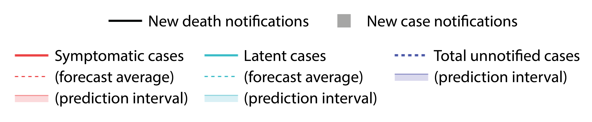

<!-- Knit this page first -->

```{r setup, include=FALSE}

knitr::opts_chunk$set(
  echo=FALSE, message = FALSE, warning = FALSE, cache = FALSE, out.width = '100%', out.height = '550px'
)

# source('R/run_nowcast_US.R') # replaced with sourcing in crontab

library(tidyverse)
source('R/nowcast.R')
#source('R/data.R')

params.US <- readRDS("data/params.US.rds")

load_nowcast <- function(admin) {
  readRDS(paste0("data/output/", admin, ".nowcast.from.cases.rds"))
}

US <- load_nowcast("US")

cases.US <- readRDS('data/cases.US.rds')
statesvector <- cases.US %>% select(-Date, -US) %>% names()

for(s in statesvector) {
  assign(s, load_nowcast(s), envir = .GlobalEnv)
}

# start.time <- proc.time()
```

## {.tabset .tabset-fade}

### USA

```{r US}

# Plot_R_effective(US, legend = FALSE)

# Export single plot
p <- plot_nowcast_from_case_reports(US, plotcumulative = TRUE, maxy = 10^8, legend = FALSE)
htmlwidgets::saveWidget(p, "USnowcast_plot.html")

# plot inline
# plot_nowcast_from_case_reports(US, maxy = 10^8, legend = FALSE)

# plot dashboard
plot_dashboard(US, params.US, plotcumulative = TRUE)
```

### AK
```{r AK}
plot_dashboard(AK, params.US, plotcumulative = TRUE)
```

### AL
```{r AL}
plot_dashboard(AL, params.US, plotcumulative = TRUE)
```

### AR
```{r AR}
plot_dashboard(AR, params.US, plotcumulative = TRUE)
```

### AZ
```{r AZ}
plot_dashboard(AZ, params.US, plotcumulative = TRUE)
```

### CA
```{r CA}
plot_dashboard(CA, params.US, plotcumulative = TRUE)
```

### CO
```{r CO}
plot_dashboard(CO, params.US, plotcumulative = TRUE)
```

### CT
```{r CT}
plot_dashboard(CT, params.US, plotcumulative = TRUE)
```

### DC
```{r DC}
plot_dashboard(DC, params.US, plotcumulative = TRUE)
```

### DE
```{r DE}
plot_dashboard(DE, params.US, plotcumulative = TRUE)
```

### FL
```{r FL}
plot_dashboard(FL, params.US, plotcumulative = TRUE)
```

### GA
```{r GA}
plot_dashboard(GA, params.US, plotcumulative = TRUE)

# Export single plot
p <- plot_nowcast_from_case_reports(GA, plotcumulative = TRUE, maxy = 10^7, legend = FALSE)
htmlwidgets::saveWidget(p, "GAnowcast_plot.html")

```

### HI
```{r HI}
plot_dashboard(HI, params.US, plotcumulative = TRUE)
```

### IA
```{r IA}
plot_dashboard(IA, params.US, plotcumulative = TRUE)
```

### ID
```{r ID}
plot_dashboard(ID, params.US, plotcumulative = TRUE)
```

### IL
```{r IL}
plot_dashboard(IL, params.US, plotcumulative = TRUE)
```

### IN
```{r IN}
plot_dashboard(IN, params.US, plotcumulative = TRUE)
```

### KS
```{r KS}
plot_dashboard(KS, params.US, plotcumulative = TRUE)
```

### KY
```{r KY}
plot_dashboard(KY, params.US, plotcumulative = TRUE)
```

### LA
```{r LA}
plot_dashboard(LA, params.US, plotcumulative = TRUE)
```

### MA
```{r MA}
plot_dashboard(MA, params.US, plotcumulative = TRUE)
```

### MD
```{r MD}
plot_dashboard(MD, params.US, plotcumulative = TRUE)
```

### ME
```{r ME}
plot_dashboard(ME, params.US, plotcumulative = TRUE)
```

### MI
```{r MI}
plot_dashboard(MI, params.US, plotcumulative = TRUE)
```

### MN
```{r MN}
plot_dashboard(MN, params.US, plotcumulative = TRUE)
```

### MO
```{r MO}
plot_dashboard(MO, params.US, plotcumulative = TRUE)
```

### MS
```{r MS}
plot_dashboard(MS, params.US, plotcumulative = TRUE)
```

### MT
```{r MT}
plot_dashboard(MT, params.US, plotcumulative = TRUE)
```

### NC
```{r NC}
plot_dashboard(NC, params.US, plotcumulative = TRUE)
```

### ND
```{r ND}
plot_dashboard(ND, params.US, plotcumulative = TRUE)
```

### NE
```{r NE}
plot_dashboard(NE, params.US, plotcumulative = TRUE)
```

### NH
```{r NH}
plot_dashboard(NH, params.US, plotcumulative = TRUE)
```

### NJ
```{r NJ}
plot_dashboard(NJ, params.US, plotcumulative = TRUE)
```

### NM
```{r NM}
plot_dashboard(NM, params.US, plotcumulative = TRUE)
```

### NV
```{r NV}
plot_dashboard(NV, params.US, plotcumulative = TRUE)
```

### NY
```{r NY}
plot_dashboard(NY, params.US, plotcumulative = TRUE)
```

### OH
```{r OH}
plot_dashboard(OH, params.US, plotcumulative = TRUE)
```

### OK
```{r OK}
plot_dashboard(OK, params.US, plotcumulative = TRUE)
```

### OR
```{r OR}
plot_dashboard(OR, params.US, plotcumulative = TRUE)
```

### PA
```{r PA}
plot_dashboard(PA, params.US, plotcumulative = TRUE)
```

### RI
```{r RI}
plot_dashboard(RI, params.US, plotcumulative = TRUE)
```

### SC
```{r SC}
plot_dashboard(SC, params.US, plotcumulative = TRUE)
```

### SD
```{r SD}
plot_dashboard(SD, params.US, plotcumulative = TRUE)
```

### TN
```{r TN}
plot_dashboard(TN, params.US, plotcumulative = TRUE)
```

### TX
```{r TX}
plot_dashboard(TX, params.US, plotcumulative = TRUE)
```

### UT
```{r UT}
plot_dashboard(UT, params.US, plotcumulative = TRUE)
```

### VA
```{r VA}
plot_dashboard(VA, params.US, plotcumulative = TRUE)
```

### VT
```{r VT}
plot_dashboard(VT, params.US, plotcumulative = TRUE)
```

### WA
```{r WA}
plot_dashboard(WA, params.US, plotcumulative = TRUE)
```

### WI
```{r WI}
plot_dashboard(WI, params.US, plotcumulative = TRUE)
```

### WY
```{r WY}
plot_dashboard(WY, params.US, plotcumulative = TRUE)
```

### Guam
```{r GU}
plot_dashboard(GU, params.US, plotcumulative = TRUE)
```

### Northern Mariana Islands
```{r MP}
plot_dashboard(MP, params.US, plotcumulative = TRUE)
```

### Puerto Rico
```{r PR}
plot_dashboard(PR, params.US, plotcumulative = TRUE)
```

### US Virgin Islands
```{r VI}
plot_dashboard(VI, params.US, plotcumulative = TRUE)
```

<!-- ##  -->

<!-- The nowcast for the whole US is calculated from case reports at the national level. It is not the sum of the state level nowcasts. The nowcast for the whole US does not necessarily agree with the the sum of state level nowcasts. -->

### Parameters

**Infection fatality rate** = `r params.US$IFR`

**Symptom-onset-to-reporting interval:**  
Distribution: `r params.US$effective.infectious.period$dist`  
Mean = `r params.US$effective.infectious.period$mean`  
Shape = `r params.US$effective.infectious.period$shape`

**Incubation period:**  
Distribution: `r params.US$incubation.period$dist`  
Mean = `r params.US$incubation.period$mean`  
Shape = `r params.US$incubation.period$shape`

**Symmptom-onset-to-death interval:**  
Distribution: `r params.US$onset.to.death.period$dist`  
Mean = `r params.US$onset.to.death.period$mean`  
Shape = `r params.US$onset.to.death.period$shape`  
