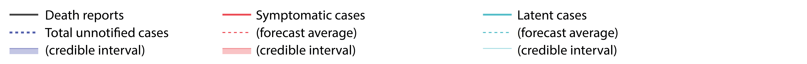

```{r setup, include=FALSE}

library(tidyverse)
library(tibbletime)
library(padr)
library(tvReg)
library(forecast)
source('R/nowcast.R')
source('R/data.R')
```

<!-- Get fatalities reports for US states -->
```{r data, include=FALSE, message = FALSE, warning = FALSE, cache = FALSE}
fatalities.US <- readRDS('data/fatalities.US.rds')
```

<!-- Set params for US -->
```{r params, include=FALSE, message = FALSE, warning = FALSE, cache = FALSE}
params.US <- list(
  admin = "US", # state or country
  
  # https://www.imperial.ac.uk/media/imperial-college/medicine/sph/ide/gida-fellowships/Imperial-College-COVID19-NPI-modelling-16-03-2020.pdf
  IFR = .009, 

  # accepted value
  infectious.period = list(dist="exponential", mean=7),   
  
  # our analysis onset-to-reporting
  effective.infectious.period = list(dist="gamma", mean=5.95, shape=2.2788163), 
  
  # our analysis of US data
  incubation.period = list(dist="gamma", mean=5.89, shape=2.4265511), 
  
  # Our analysis of US data (not used)
  report.to.death.period = list(dist="skewnormal", mean = 1.33, sd = sqrt(11.06),
                                location = -2.388990, # xi
                                scale = 4.322, # omega
                                shape = 1.447), # alpha
  
  # from China data: lognormal distribution with location 2.84, scale 0.52 
  # (Jung et al.) https://doi.org/10.3390/jcm9020523 
  onset.to.death.period = list(dist="lognormal", mean = 19.9, sd = 11.4)
)

```

<!-- calculate nowcast for US -->
```{r nowcasts, include=FALSE, echo=FALSE, message = FALSE, warning = FALSE, cache = FALSE}
fatalities.US.all <- fatalities.US %>% dplyr::select(Date, deaths = US)

US.nowcast <- nowcast_from_deaths_with_onset_to_death(deathreports = fatalities.US.all, params.US)
# saveRDS(US.nowcast,"data/US.nowcast.from.fatalities.rds")
```

```{r US, echo=FALSE, message = FALSE, warning = FALSE, cache = FALSE, out.width = '100%'}
plot_nowcast_from_death_reports(US.nowcast) %>% plotly::layout(showlegend=TRUE)
```



### Parameters

**IFR** = `r params.US$IFR`

**Symptom-onset-to-reporting interval:**  
Distribution: `r params.US$effective.infectious.period$dist`  
Mean = `r params.US$effective.infectious.period$mean`  
Shape = `r params.US$effective.infectious.period$shape`

**Incubation period:**  
Distribution: `r params.US$incubation.period$dist`  
Mean = `r params.US$incubation.period$mean`  
Shape = `r params.US$incubation.period$shape`

**Symmptom-onset-to-death interval:**  
Distribution: `r params.US$onset.to.death.period$dist`  
Mean: `r params.US$onset.to.death.period$mean`  
Std dev: `r params.US$onset.to.death.period$sd`  